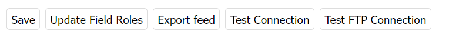
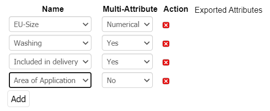

# FACT-Finder® Web Components for OXID eShop

[](https://packagist.org/packages/omikron/oxid-factfinder)
[](https://github.com/FACT-Finder-Web-Components/oxid-eshop-module/graphs/contributors)

This document helps you to integrate the FACT-Finder® Web Components SDK into your Oxid Shop. In addition, it gives a
concise overview of its primary functions. The first chapter *Installation* walks you through the suggested installation
process. The second chapter *Backend Configuration* explains the customisation options in the Oxid backend. The
final chapter *Web Component Integration* describes how the web components interact with the shop system and how to
customise them. 

## Table of contents
- [Requirements](#requirements)
- [Installation](#installation)
- [Activating the Module](#activating-the-module)
- [Backend Configuration](#backend-configuration)
    - [Main Settings](#main-settings)
        - [Buttons](#buttons)
            - [Test Connection Button](#test-connection-button)
            - [Export Feed Button](#export-feed-button)
            - [Test FTP Connection Button](#test-ftp-connection)
            - [Update Field Roles Button](#update-field-roles)
    - [Advanced Settings](#advanced-settings)
        - [Proxy](#proxy)
    - [Features Settings](#features-settings)
        - [Using FACT-Finder® on category pages](#using-fact-finder-on-category-pages)
    - [Feed Settings](#feed-settings)
    - [Export Settings](#export-settings)
- [Export Methods](#export-methods)
    - [HTTP Export](#http-export)
    - [FTP Export](#ftp-export)
        - [Admin Panel Export](#admin-panel-export)
        - [Console Commands](#console-commands)
- [Tracking](#tracking)
  - [Login](#login)
  - [Click on Product](#click-on-product)
  - [Add Product to Cart](#add-product-to-cart)
  - [Place an Order](#place-an-order)
- [Contribute](#contribute)
- [License](#license)

## Requirements
- OXID eShop 6.1.x
- PHP version 7.2 or higher

## Installation

To install the module, open your terminal and run the command:

    composer require omikron/oxid-factfinder

## Activating the Module

From the root of your Oxid installation, clear the cache with:

    rm -rf source/tmp/*
    
Check in the Oxid 2 backend "Stores → Configuration → Advanced → Advanced" if the module output is activated.
    


## Backend Configuration

Once the module is activated, you can find the configurations page under "Extensions → Modules → FACT-Finder® Web Components | Omikron Data Quality GmbH -> Settings".
All sections will be covered in the following paragraphs.

### Main Settings


This section contains a critical configuration, which is required in order for the module to work.
All fields are self-explained.
Configuration set here is used by both Web Components and during the server side communication with FACT-Finder® instance. 
Credentials you will be given should be placed here.

* Server URL - FACT-Finder® instance url   
  **Note:** Server URL should contain a used protocol: (e.g. `https://`) and should end with an endpoint specific for a given version (e.g. in version 7.3 its `FACT-Finder-7.3`, in NG `fact-finder` )
* Channel - Channel you want to serve data from     
  **Note** The number of channel fields is adjusted to the number of active languages used in application. Please make sure you set a correct channel for a given language.
* Username - for importing data to FF
* Password - for importing data to FF
* Username - for fetching data from FF
* Password - for fetching data from FF
* Authorization Prefix
* Authorization Postfix   
  **Note:** FACT-Finder® NG does not require fields `Authorization Prefix` and `Authorization Postfix` to be set. Please omit these fields in this case. 
* Version - Used FACT-Finder® version   
  **Note:** Module supports FACT-Finder® from version 6.9 up to NG. by selecting the wrong version you may cause the Web Components to be unable to communicate with FACT-Finder® 
* API Version - Used FACT-Finder® api version   
  **Note:** Module supports FACT-Finder® api version `v4` and `v5`. By selecting the wrong api version you may cause the Web Components to be unable to communicate with FACT-Finder®

### Buttons



#### Test Connection Button
By clicking the `Test Connection` button you can check if your credentials are correct.
This functionality uses form data, so there is no need to save first.
**Note:** This functionality uses `de` channel input value. 

#### Export Feed Button
It is a one of possible ways of exporting feed. You can find more details in section [Admin Panel Export](#admin-panel-export)  

#### Test FTP Connection Button
This functionality allows you to test if your shop can successfully connect to configured FTP/SFTP server.
It uses parameters passed down with the request so there is no need to save the configuration before.

#### Update Field Roles Button
This functionality allows you to update field roles if you have changed them in FACT-Finder.
The field roles are by default configured accordingly to the columns exported by the module.
If you are about change one of the column name that serves as a role e.g. `Master` or `ProductNumber`, that holds the `Master article number` and `Product number` roles respectively, please remember to update the field roles with that functionality

### Advanced Settings

* `Use URL params?` - check this option if you want Web Components to push each used query parameter to the URL,
* `Additional parameters` - here you can define extra parameters for each of these properties: `add-params`, `add-tracking-params`, `keep-url-params`, `parameter-whitelist`.
Values will be passed to the Web Components and used in communication.
You can find more information about mentioned properties purposes in Web Components [documentation](https://web-components.fact-finder.de/api/3.x/ff-communication#tab=api).
* `Anonymize User ID?` - check this option if you want to send user id with tracking requests in anonymized form. By default the regular id field from user table is sent.  
* `Use Proxy` - check this option if you want each request sends by Web Components first reach the dedicated module controller which forwards it to the FACT-Finder.
**Note:** If you plan to use proxy, consider reading below paragraph as it requires full instruction how to enable it properly. 
* `How to count single click on "Add to cart" button?` - select how would you like to count single click on "Add to cart" button
* `Send the SID as userId when user not logged in?`

#### Proxy
Proxy feature adds a oxid controller which serves as a middleware between Web Components and FACT-Finder®.
The data flow with proxy enabled is illustrated by the graph below.

Having a middleware controller brings many possibilities to customize the request and the response.
In addition, if forwarded request does not result with a correct response, you can implement fallback strategy, starting from this point.

```php
   //src/Controller/SearchResultController.php:65
   protected function fallback(): void
    {
        //this function could be used to implement fallback logic in case of any communication error.
        $this->showJsonAndExit('');
    }
```

To enable proxy you need to change your HTTP server configuration by adding two rewrite rules.
This is necessary because Web Components appends a URL parts to the base URL making it unreadable by the Oxid.
This is because Oxid use query parameters `cl` and `fnc` to instantiate specific controller and execute its function.
There is no routing that use url parts, hence any AJAX requests must target index.php file with the aforementioned parameters.
Without this rules any request will lead to 404.

NGINX

```nginx
  location ~ \.ff  {
      rewrite [a-zA-Z].ff /$1 break;
  }

  # the the version might need to be adjusted, depends on the API version you use
  location ~ /rest/v  {
      rewrite rest/v[0-9]/[a-zA-Z]*/ /$1 break;
   }
```

APACHE

```apache
RewriteRule (.*\.ff)$ /$1 [L]

# the the version might need to be adjusted, depends on the API version you use
RewriteRule /rest/v[0-9] /$1 [L]
```

### Features Settings


* `Use FACT-Finder® for category pages?` - check this option to use Web Components in category pages. More information in separate paragraph.
* Campaigns - enables `ff-campaign-product` on product page and `ff-campaign-feedbacktext`, `ff-campaign-shopping-cart`on cart page
* Recommendations - enables `ff-recommendation` on product page
* Similar products - enables `ff-similar-products` on product page
* Pushed products - enables `ff-campaign-pushed-products>` on cart page     

### Using FACT-Finder® on category pages
Module in order to preserve categories URLs and hence SEO get use of standard Oxid routing with the combination of FACT-Finder® availability to pass custom parameters to search request.
Once user lands on category page search event is emitted immediately (thanks to `search-immediate` communication parameter usage).

### Feed Settings

This section allows setting attributes to export.
If you want to export the attribute to separate column, choose it from the select input and set `Multi-Attribute` column value to `No`.
if `Multi-Attribute` is set to `Yes`, the attribute is placed in an aggregate column `FilterAttributes`
**Note:** Selection attributes are always placed in `FilterAttributes` automatically.

### Export Settings


Use following fields if you want to export feed file to your FTP server, where it could be then imported by FACT-Finder®.
* FTP host 
* FTP port 
* FTP user
* FTP password

Additional:
* SSL-enabled - check this option, if your FTP server requires connection using secure protocol
* Automatic import of product - enables import executed by FACT-Finder® after uploading   
  **Note:** This option will not work if you have no FTP server configured
* Import Data - triggers Data (search database) 
* Import Suggest - triggers Suggest database 
* Import Recommendation - triggers Recommendation database
* Basic Auth user for HTTP export
* Basic Auth password for HTTP export   
  **Note:** Basic Auth is used to secure HTTP based export, you can read more about in the next section.

## Export Methods

### HTTP Export
This method uses a specific URL under which the feed will be available.
You can set FACT-Finder® to download the feed directly from this location:

    [YOUR_SHOP_URL]?cl=http_article_feed&fnc=export

For category export:

    [YOUR_SHOP_URL]?cl=http_category_feed&fnc=export

For suggest category export:

    [YOUR_SHOP_URL]?cl=http_suggest_category_feed&fnc=export

**Note:** Please keep in mind that the feed file is not directly available under the location. There is an export mechanism that does it on demand, so the whole process may take some time.

#### Basic Authentication
Using [Export Settings](#export-settings) you can secure the HTTP export by setting up a Basic Authentication.
Please remember that in this case you will need to include credentials in the URL, otherwise FACT-Finder® will not
be able to download the feed file. You can include Basic Authentication credentials in URL using following syntax: 
    
    https://[username]:[password]@[REST_OF_URL]

### FTP Export
With this approach, the exported feed file is uploaded to a specific FTP/SFTP server.
Once the feed file is uploaded, FACT-Finder® is requested to begin an import based on uploaded file (optional).
All settings related to this exporting method are found in [Export Settings](#export-settings).
Fields Key and Key Passphrase are dedicated only to the SFTP.
Field SSL Enabled is dedicated only to FTP.

**Note:** Used FTP/SFTP server should be also accessible to FACT-Finder®.

#### Admin Panel Export
`Export Feed` button located in module configuration, could be used to manually trigger an export.
By clicking this button, you trigger the whole export process, including upload to FTP server and triggering a FACT-Finder® import (if enabled).

**Note:** This method does not download the feed file to your local file system. If you need to view it, please use the [HTTP Export](#http-export)

**Note:** Category export is not available here as clicking button start import on channel but category feed is supposed to be an enrichment for main article feed

#### Console Commands
There are two console commands located in the module `bin` directory, available for use.
Simply run them using the installed PHP CLI.

    php [MODULE_LOCATION]/bin/[COMMAND_NAME].php

* `feed-write.php` - only saves the feed file on local file system
* `feed-upload.php` - run full integration (just like clicking the `Export Feed` button in admin panel)

If you are using Oxid Enterprise and its multishop feature, you can specify the shop ID by using the `-s` parameter, e.g.

    php source/modules/ff/ffwebcomponents/bin/feed-write.php -s1

If your shop supports multiple languages, enter the language identifier of the language you want to export by adding `-l` parameter to the command (e.g. `php bin/feed-write.php -l 1`).
You can check the language identifiers at "Master Settings -> Languages".
You can specify the type of the feed with the `-t` option. Default value is `product`. In order to switch for category, please use `-t category`


## Tracking
Here you can find a full [Tracking Guide](https://web-components.fact-finder.de/documentation/4.x/tracking-guide). 
This module follows that guide in order to provide tracking of following events:

 ### Login
This event is tracked automatically by the `ff-communication` element upon receiving `uid` attribute.

### Click on Product
This event is tracked automatically by the `ff-record` element bindings. **Note:** for this to work a directive `data-redirect` has to be added

### Add Product to Cart
We offer a `registerAddToCartListener` function which helps to register `click` events on form submit buttons. **Note:** Example usage can be found in `src/views/frontend/blocks/campaign/product.tpl`

### Place an Order 
This event is tracked by the `ff-checkout-tracking` element which is implemented on order confirmation page

## Contribute
For more information, click [here](.github/CONTRIBUTING.md)

You can also open a new issue if You spot a bug or just have an idea for module improvement
To check currently opened issues [here](https://github.com/FACT-Finder-Web-Components/oxid-eshop-module/issues).

## License
FACT-Finder® Web Components License. For more information see the [LICENSE](LICENSE) file.
