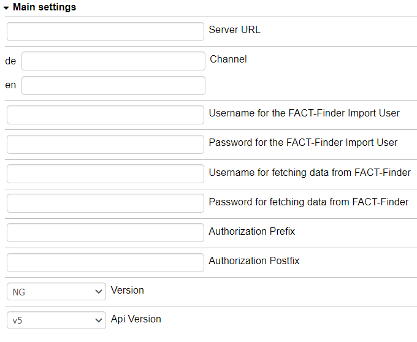
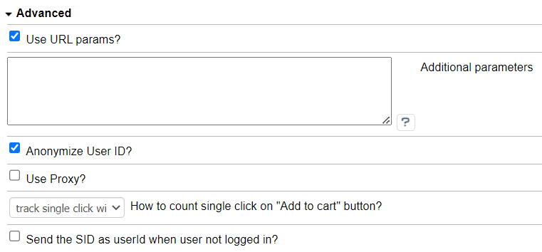
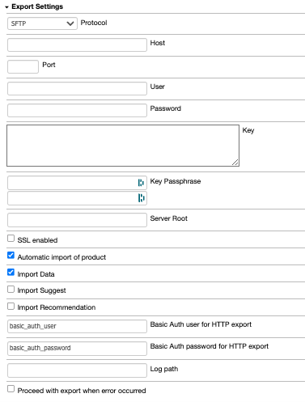

# FACT-Finder® Web Components for OXID eShop

This document helps you to integrate the FACT-Finder® Web Components SDK into your Oxid Shop. In addition, it gives a
concise overview of its primary functions. The first chapter *Installation* walks you through the suggested installation
process. The second chapter *Backend Configuration* explains the customisation options in the Oxid backend. The
final chapter *Web Component Integration* describes how the web components interact with the shop system and how to
customise them. 

## Table of contents
- [Requirements](#requirements)
- [Installation](#installation)
- [Activating the Module](#activating-the-module)
- [Backend Configuration](#backend-configuration)
    - [Main Settings](#main-settings)
        - [Test Connection Button](#test-connection-button)
        - [Export Feed Button](#export-feed-button)
    - [Advanced Settings](#advanced-settings)
    - [Features Settings](#features-settings)
        - [Using FACT-Finder® on category pages](#using-fact-finder-on-category-pages)
    - [Export Settings](#export-settings)
- [Export Methods](#export-methods)
    - [HTTP Export](#http-export)
    - [FTP Export](#ftp-export)
        -[Admin Panel Export](#admin-panel-export)
        -[Console Commands](#console-commands)
- [Contribute](#contribute)
- [License](#license)

## Requirements
- OXID eShop 6.1.x
- PHP version 7.1 or higher

## Installation

To install the module, open your terminal and run the command:

    composer require omikron/oxid-factfinder:dev-master

At the moment, the module is a pre-release, hence the :dev-master used as version.

## Activating the Module

From the root of your Oxid installation, clear the cache with:

    rm -rf source/tmp/*
    
Check in the Oxid 2 backend "Stores → Configuration → Advanced → Advanced" if the module output is activated.
    

## Backend Configuration

Once the module is activated, you can find the configurations page under "Extensions → Modules → FACT-Finder® Web Components | Omikron Data Quality GmbH -> Settings".
All sections will be covered in the following paragraphs.

### Main Settings

This section contains critical configuration, which is required in order for the module to work.
All fields are self-explained.
Configuration set here is used by both Web Components and during the server side communication with FACT-Finder® instance. 
Credentials you will be given should be placed here.

* Server URL - FACT-Finder® instance url   
  **Note:** Server URL should contain a used protocol: (e.g. `https://`) and should end with an endpoint specific for a givenversion (e.g. in version 7.3 its `FACT-Finder-7.3`, in NG `fact-finder` )
* Channel - Channel you want to serve data from
* Username
* Password
* Authorization Prefix
* Authorization Postfix   
  **Note:** FACT-Finder® NG does not require fields `Authorization Prefix` and `Authorization Postfix` to be set. Please omit these fields in this case. 
* API Version - Used FACT-Finder® version   
  **Note:** Module supports FACT-Finder® from version 6.9 up to NG. by selecting the wrong version you may cause the Web Components to be unable to communicate with FACT-Finder® 

### Test Connection Button
By clicking the `Test Connection` button you can check if your credentials are correct.
This functionality uses form data, so there is no need to save first.

### Export Feed Button
It is a one of possible ways of exporting feed. You can find more details in section [Admin Panel Export](#admin-panel-export)  

### Advanced Settings

* `Use URL params?` - check this option if you want Web Components to push each used query parameter to the URL,
* `Additional parameters` - here you can define extra parameters for each of these properties: `add-params`, `add-tracking-params`, `keep-url-params`, `parameter-whitelist`.
Values will be passed to the Web Components and used in communication.
You can find more information about mentioned properties purposes in Web Components [documentation](https://web-components.fact-finder.de/api/3.x/ff-communication#tab=api).  

### Features Settings

* `Use FACT-Finder® for category pages?` - check this option to use Web Components in category pages. More information in separate paragraph.
* Campaigns - enables `ff-campaign-product` on product page and `ff-campaign-feedbacktext`, `ff-campaign-shopping-cart`on cart page
* Recommendations - enables `ff-recommendation` on product page
* Similar products - enables `ff-similar-products` on product page
* Pushed products - enables `ff-campaign-pushed-products>` on cart page     

### Using FACT-Finder® on category pages
Module in order to preserve categories URLs and hence SEO get use of standard Oxid routing with the combination of FACT-Finder® availability to pass custom parameters to search request.
Once user lands on category page search event is emitted immediately (thanks to `search-immediate` communication parameter usage).

### Export Settings

Use following fields if you want to export feed file to your FTP server, where it could be then imported by FACT-Finder®.
* FTP host 
* FTP port 
* FTP user
* FTP password

Additional:
* SSL-enabled - check this option, if your FTP server requires connection using secure protocol
* Automatic import of product - enables import executed by FACT-Finder® after uploading   
  **Note:** This option will not work if you have no FTP server configured
* Import Data - triggers Data (search database) 
* Import Suggest - triggers Suggest database 
* Import Recommendation - triggers Recommendation database
* Basic Auth user for HTTP export
* Basic Auth password for HTTP export   
  **Note:** Basic Auth is used to secure HTTP based export, you can read more about in the next section.

## Export Methods

### HTTP Export
This method uses a specific URL under which the feed will be available.
You can set FACT-Finder® to download the feed directly from this location:

    [YOUR_SHOP_URL]?cl=http_article_feed&fnc=export

**Note:** Please keep in mind that the feed file is not directly available under the location. There is an export mechanism that does it on demand, so the whole process may take some time.

#### Basic Authentication
Using [Export Settings](#export-settings) you can secure the HTTP export by setting up a Basic Authentication.
Please remember that in this case you will need to include credentials in the URL, otherwise FACT-Finder® will not
be able to download the feed file. You can include Basic Authentication credentials in URL using following syntax: 
    
    https://[username]:[password]@[REST_OF_URL]

### FTP Export
With this approach, the exported feed file is uploaded to a specific FTP server.
Once the feed file is uploaded, FACT-Finder® is requested to begin an import based on uploaded file (optional).
All settings related to this exporting method are found in [Export Settings](#export-settings).
**Note:** Used FTP server should be also accessible to FACT-Finder®.

#### Admin Panel Export
`Export Feed` button located in module configuration, could be used to manually trigger an export.
By clicking this button, you trigger the whole export process, including upload to FTP server and triggering a FACT-Finder® import (if enabled).
**Note:** This method does not download the feed file to your local file system. If you need to view it, please use the
[HTTP Export](#http-export)

#### Console Commands
There are two console commands located in the module `bin` directory, available for use.
Simply run them using the installed PHP CLI.

    `php [MODULE_LOCATION]/bin/[COMMAND_NAME].php`
* feed-write - only saves the feed file on local file system
* feed-upload - run full integration (just like clicking the `Export Feed` button in admin panel)

If your shop supports multiple languages, enter the language identifier of the language you want to export by adding `lang` option to the command (e.g. `php bin/feed-write.php lang 1`).
You can check the language identifiers at "Master Settings -> Languages". 

    
## Contribute
For more information, click [here](.github/CONTRIBUTING.md)

You can also open a new issue if You spot a bug or just have an idea for module improvement
To check currently opened issues [here](https://github.com/FACT-Finder-Web-Components/oxid-eshop-module/issues).

## License
FACT-Finder® Web Components License. For more information see the [LICENSE](LICENSE) file.
